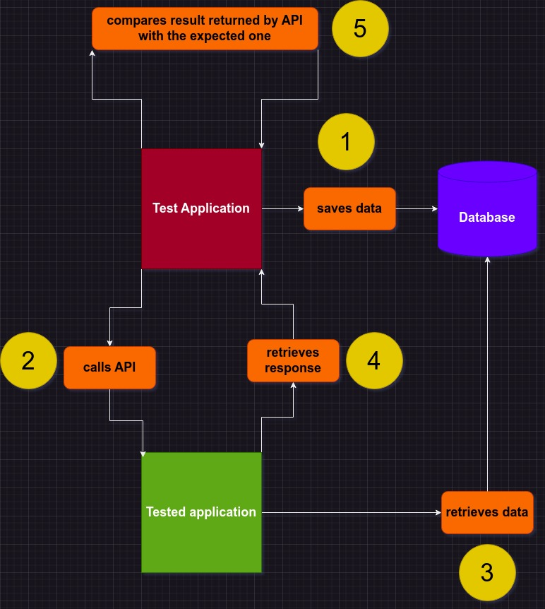

# POC: Cucumber + Selenium + TestNG + Spring Boot + Spring JPA + Hibernate + Postgresql (sequential and parallel testing)

POC implemented with the latest versions of Cucumber + Selenium + TestNG + Spring Boot + Spring JPA + Hibernate +
JDK (21) - sequential and parallel testing. It allows to make automated tests for a web application (in this case the
target is my portfolio https://andre-i.eu). See also
the [single-thread](https://github.com/goto-eof/andre-i-test-selenium-cucumber-spring-boot-single-thread)
and [multi-thread](https://github.com/goto-eof/andre-i-test-selenium-cucumber-spring-boot-multi-thread) versions.

# Configuration

Run docker container from `docker` directory. This is the test DBMS. It should be used also by the application that is
under test.

```
sudo docker compose up -d
```

Edit `config.properties` by choosing your OS and browser:

```
# can be linux or windows
com.andreidodu.test.os=linux

# can be firefox or chrome
com.andreidodu.test.browser=chrome
```

# Run tests

Run the following command from the root of the project:

 ```
  ./gradlew clean test
 ```

# Test flow



# Video

Selenium in action:

[](https://www.youtube.com/watch?v=0-qYpUTGrhw)

# Moreover

- this application was developed on Linux and tested on Linux Ubuntu 24.04 LTS (and should work also on Windows 11)
- for Linux users: in case of browser issues, make sure that firefox or chrome were not installed from snap (but with
  apt-get install)

  
